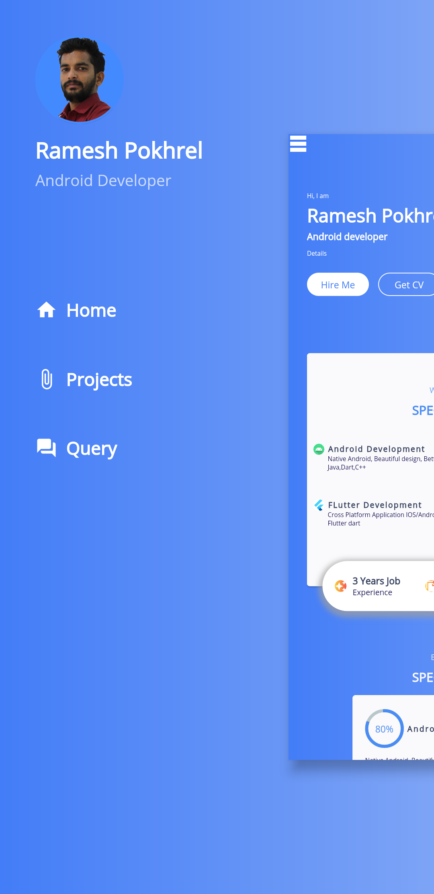

<!-- PROJECT SHIELDS -->

<!-- PROJECT LOGO -->
 

  

  <h3 align="center">Flutter-Resume-Template</h3>

  

    An awesome Resumemade with flutter!
     

<!-- ABOUT THE PROJECT -->
## About The Project

    
    
    

Best Resume template made with flutter. It uses Flutter Bloc pattern for state management.
:smile:

I got inspired from Dribble Design <a href="https://dribbble.com/shots/7524299-Personal-Portfolio-CV-Resume-Template">Personal-Portfolio-CV-Resume-Template</a>
.

### Built With

* [Flutter](https://flutter.dev/)
* [BLOC](https://pub.dev/packages/flutter_bloc)
* [Dart](https://flutter.dev/)

<!-- CONTACT -->
## Contact

Your Name - [@devil_kaxo](https://twitter.com/devil_kanxo) - kanxoramesh@gmail.com

Project Link: [https://github.com/RameshPokharel/FlutterResumeDesign](https://github.com/RameshPokharel/FlutterResumeDesign)

